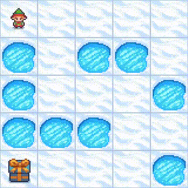

# From A to B with RL !

👋 Hello !

This repository is the two-week project in Data Science of four people
from `le Wagon` bootcamp in Paris. **Our aim is to adapt Reinforcement Learning algorithms to solve [Gymnasium](https://gymnasium.farama.org/) [environments](#environments)** using [several different algorithms](#algorithms).

You can clone this repo, and check for yourself how the algorithms perform. All the instructions are available in the [setup](#setup) section.

## Environments

### Frozen Lake 🌲

<p align="center">  </p>

In this very simple environment, we have :
- the agent state $s$, an integer from 0 to 24 representing its square nº.
- the possible agent actions $a$, here discrete actions $\leftarrow (0), \downarrow (1), \rightarrow (2), \uparrow (3)$
- a reward $r = +1$ on the square where the gift lies.

Reaching the gift ends an 'episode'. **Falling into one of the frozen lakes triggers the end of an episode too with no reward**.

In the original game, the agent state $s$ corresponds to their observation $o$, which means the agent does not know its surroundings.

#### Variants

We have developed two variants of the Frozen Lake environment :

- One setting a **negative reward $ r = -1 $ for falling into the lake**
- One **allowing the agent to know the _type_ of the squares next to them**

### Car Racing 🏎️

<p align="center">  </p>

In this more complex environment :

- the agent state is actually a gameplay image (by default), or a stack of several successive images (we have chosen 3 images).
- the possible actions are discrete : `idle` (0), `left` (1), `right` (2), `gas` (3) and `brake` (4)
- the car gets a **negative reward $r=-0.1$ for each frame** and gets **a positive reward $r\simeq 20$ for each new track tile reached by the car**

#### Variants

The environment also works with **continuous actions** along three axes :

- left/right in the range $[-1, \;1 ]$
- gas/no gas in the range $[0, \; 1]$
- brake/no brake in the range $[0, \; 1]$

which means you can both accelerate, brake and turn at the same time : a perfect recipe for drifting !

### Mountain car ⛏️


## Algorithms

We are using several algorithms to solve these environments, from the simplest
(Q-learning) which uses no neural network, to the most complex (Proximal Policy
Optimization).

|                          Algorithm | Neural Network ?  | Infinite States    | Continuous Actions  |
|-----------------------------------:|:-----------------:|:------------------:|:-------------------:|
|                         Q-Learning |         ❌        |         ❌         |          ❌         |
|               Deep-Q Network (DQN) |         ✅        |         ✅         |          ❌         |
|       Advantage Actor Critic (A2C) |         ✅        |         ✅         |          ✅         |
| Proximal Policy Optimization (PPO) |         ✅        |         ✅         |          ✅         |

Some of them can deal with having a virtually infinite amount of states or observations. In [Frozen Lake](#frozen-lake-🌲),
the number of states is small (the number of squares) whereas for Car Racing, the states would be all the different
possible images returned by the game, which is nearly infinite.

Some algorithms can _not_ manage continuous actions, since they rely on computing _all the possible actions_ from a given
state and checking which one would lead to the highest reward. This is the case of Q-learning and DQN, which are therefore
not adapted to the continuous variant of [Car Racing](#car-racing-🏎️) or [Mountain Car](#mountain-car-⛏️).

### Some mathematical definitions

To understand a bit how these algorithms work, we need to introduce a few quantities.
A **policy** $\pi$ is what the agent uses to decide of an action based on its state $s$. We will for now suppose that the agent strictly follows that policy for all instants $t$, so we add a few subscripts $\,\cdot_t$ to represent that

$$ \pi(s_t) = a_t $$

Following this policy, we can define the **state value $V_\pi (s)$**.

> _Imagine starting from a checkpoint at state $s$ at $t=0$ and let the game in 'auto-mode' using the policy $\pi$ until you reach the end of the game. We will have to sum all the rewards obtained by the agent_:

$$ v_\pi (s) =  \left \{ \sum_t  r_t \Big | s_0 = s \right \} $$

For mathematical reasons, we decide to put an emphasis on the short-term rewards by adding a **discount factor $0 < \gamma < 1$** in the previous equation, which will artificially decrease the "value" of rewards in the distant future :

$$ V_\pi (s) = \left \{ \sum_t r_t \gamma^t \Big | s_0 = s \right \}$$

The **action value function $Q_\pi(s,a)$ is roughly the same quantity, however we can take _any_ action at time $t=0$ and _then_ we follow the policy $\pi$**. Computing this function, or approximating it is one of the core ideas of Q-learning and DQN. We have :

$$ Q_\pi (s,a) = \left \{ \sum_t r_t \gamma^t \Big | s_0 =s, a_0 = a\right \} $$

That function would be a two-dimensional array of size $N_s \times N_a$ in your computer memory, with $N_s$ being the number of different states and $N_a$ the number of possible actions. So, in the case of :
- [Frozen Lake](#frozen-lake-🌲), $Q$ would be a ($25 \times 4$) array, manageable
- [Car Race](#car-racing-️🏎️), the images defining the states are of size $(96 \times 96 \times 3)$ with each pixel taking a value between 0 and 255, so theoretically we have ($256^{96 \times 96  \times 3 } \times 5$) states, which is, for all practical purposes, $+\infty$. This is why regular $Q$-learning is impossible on Car Race.

### Q-learning

I think the critical question at this stage is : **how does  computing all Q-values help us teach an agent how to play games ?**. Let's assume that the $Q$ values _accurately_ represent the _true_ future rewards the agent will obtain in their episode. We can check, for every state, which action $a^*$ leads to the highest state-action value $Q(s,a^*)$. And we can define a policy $\pi^*$ to choose these 'optimal decisions' for every state $s$. Unsurprisingly, this policy is the _optimal_ policy. Mathematically, we write it as :

$$\pi^* (s) = {\rm argmax}_a \, Q(s,a)$$

The main issue is that **we do not know initially the _true_ state action values $Q(s,a)$**. We have to build them from scratch !

#### Replay memory


### Deep-Q Networks (DQN)


## Setup

We work with the `rl` virtual environment, based on Python v3.11.9, so let us
first install that python version :

```
  pyenv install 3.11.9
```

If you don't have pyenv, please [install it first](https://github.com/pyenv/pyenv).
If you are on Windows, you can install [pyenv-win](https://pyenv-win.github.io/pyenv-win/)

You then have to create a virtual environment named `rl` :

```
  pyenv virtualenv 3.11.9 rl
````

Then, you can cd to the `from-a-to-b-with-rl` folder, and check if it is activated.

If the virtual environment is not activated automatically upon entering the folder you can run:

```
  pyenv local rl
````

### Packages

The `rl` virtual environment has a few dependencies, notably :

- [pytorch](https://pytorch.org/) for the RL learning
- [numpy](https://numpy.org/) to handle a few numerical outputs
- [gymnasium](https://gymnasium.farama.org/)
- [pygame](https://www.pygame.org/news)
- [moviepy](https://pypi.org/project/moviepy/) to save video from the agent interacting with the environment

You can then decide to install the package itself (XXX
Note, for now, nothing interesting is installed except from the dependencies XXX):

```
  pip install .
````

Or just decide to install the `requirements.txt` file :

```
  pip install -r requirements.txt
```

### Notes on GPU acceleration :

If your GPU is CUDA capable, you will have to adapt your `rl` environment. If you are on Windows, you can type :

```
  pip uninstall torch

  pip install torch torchvision torchaudio --index-url https://download.pytorch.org/whl/cu121
```

If you are on Linux, you can do :

```
  pip uninstall torch

  pip3 install torch torchvision torchaudio
```

If you want to monitor the GPU in the terminal, you can type

```
  nvidia-smi -l 1
```
