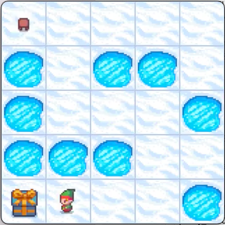

# From A to B with RL !

👋 Hello !

This repository is the two-week project in Data Science of four people
from `le Wagon` bootcamp in Paris. **Our aim is to adapt Reinforcement Learning algorithms to solve [Gymnasium](https://gymnasium.farama.org/) [environments](#environments)** using [several different algorithms](#algorithms).

You can clone this repo, and check for yourself how the algorithms perform. All the instructions are available in the [setup](#setup) section.

## Environments

### Frozen Lake 🌲

<p align="center">  </p>

In this very simple environment, we have :
- the agent state $s$, an integer from 0 to 24 representing its square nº.
- the possible agent actions $a$, here discrete actions $\leftarrow (0), \downarrow (1), \rightarrow (2), \uparrow (3)$
- a reward $r = +1$ on the square where the gift lies.

Reaching the gift ends an 'episode'. **Falling into one of the frozen lakes triggers the end of an episode too with no reward**.

In the original game, the agent state $s$ corresponds to their observation $o$, which means the agent does not know its surroundings.

#### Variants

We have developed two variants of the Frozen Lake environment :

- One setting a **negative reward $ r = -1 $ for falling into the lake**
- One **allowing the agent to know the _type_ of the squares next to them**

### Car Racing 🏎️

<p align="center">  </p>

In this more complex environment :

- the agent state is actually a gameplay image (by default), or a stack of several successive images (we have chosen 3 images).
- the possible actions are discrete : `idle` (0), `left` (1), `right` (2), `gas` (3) and `brake` (4)
- the car gets a **negative reward $r=-0.1$ for each frame** and gets **a positive reward $r\simeq 20$ for each new track tile reached by the car**

#### Variants

The environment also works with **continuous actions** along three axes :

- left/right in the range $[-1, \;1 ]$
- gas/no gas in the range $[0, \; 1]$
- brake/no brake in the range $[0, \; 1]$

which means you can both accelerate, brake and turn at the same time : a perfect recipe for drifting !

### Mountain car ⛏️


## Algorithms

We are using several algorithms to solve these environments, from the simplest
(Q-learning) which uses no neural network, to the most complex (Proximal Policy
Optimization).

|                          Algorithm | Neural Network ?  | Infinite States    | Continuous Actions  |
|-----------------------------------:|:-----------------:|:------------------:|:-------------------:|
|                         Q-Learning |         ❌        |         ❌         |          ❌         |
|               Deep-Q Network (DQN) |         ✅        |         ✅         |          ❌         |
|       Advantage Actor Critic (A2C) |         ✅        |         ✅         |          ✅         |
| Proximal Policy Optimization (PPO) |         ✅        |         ✅         |          ✅         |

Some of them can deal with having a virtually infinite amount of states or observations. In [Frozen Lake](#frozen-lake-🌲),
the number of states is small (the number of squares) whereas for Car Racing, the states would be all the different
possible images returned by the game, which is nearly infinite.

Some algorithms can _not_ manage continuous actions, since they rely on computing _all the possible actions_ from a given
state and checking which one would lead to the highest reward. This is the case of Q-learning and DQN, which are therefore
not adapted to the continuous variant of [Car Racing](#car-racing-🏎️) or [Mountain Car](#mountain-car-⛏️).

### Some mathematical definitions

To understand a bit how these algorithms work, we need to introduce a few quantities.
A **policy** $\pi$ is what the agent uses to decide of an action based on its state $s$. We will for now suppose that the agent strictly follows that policy for all instants $t$, so we add a few subscripts $\,\cdot_t$ to represent that

$$ \pi(s_t) = a_t  \text{ at all times } t$$

Following this policy, we can define the **state value $V_\pi (s)$**.

> Imagine starting from a checkpoint at state $s$ at $t=0$ and let the game run in 'auto-mode' using the policy $\pi$ until you reach the end of the game. We sum all the rewards obtained by the agent and call the result the **state_value** of the policy $\pi$ starting from state $s$:

$$ v_\pi (s) =  \left \lbrace \sum_t  r_t \Big \vert s_0 = s \right \rbrace $$

For mathematical reasons, we decide to put an emphasis on the short-term rewards by adding a **discount factor $0 < \gamma < 1$** in the previous equation, which will artificially decrease the "value" of rewards in the distant future, leading to a new quantity:

$$ V_\pi (s) = \left \lbrace \sum_t r_t \gamma^t \Big \vert s_0 = s \right \rbrace $$

The **action value function $Q_\pi(s,a)$ is roughly the same quantity, however we can take _any_ action at time $t=0$ and _then_ we follow the policy $\pi$**. Computing this function, or approximating it is one of the core ideas of Q-learning and DQN. We have:

$$ Q_\pi (s,a) = \left \lbrace \sum_t r_t \gamma^t \Big \vert s_0 =s, a_0 = a\right \rbrace $$

That function would be a two-dimensional array of size $N_s \times N_a$ in your computer memory, with $N_s$ being the number of different states and $N_a$ the number of possible actions. So, in the case of:
- [Frozen Lake](#frozen-lake-🌲), $Q$ would be a ($25 \times 4$) array, manageable
- [Car Race](#car-racing-️🏎️), the images defining the states are of size $(96 \times 96 \times 3)$ with each pixel taking a value between 0 and 255, so theoretically we have ($256^{96 \times 96  \times 3 } \times 5$) states, which is, for all practical purposes, $+\infty$. This is why regular $Q$-learning is impossible on Car Race.

### Q-learning

I think the critical question at this stage is : **how does computing Q-values help us teach an agent how to play games ?**. Let's assume that the $Q$ values _accurately_ represent the _true_ future rewards the agent will obtain in their episode. We can check, for every state, which action $a^*$ leads to the highest state-action value $Q(s,a^*)$. And we can define a policy $\pi^*$ to choose these 'optimal decisions' for every state $s$. Unsurprisingly, this policy is the _optimal_ policy. Mathematically, we write it as:

$$\pi^* (s) = {\rm argmax}_a \, Q(s,a)$$

The main issue is that **we do not know initially the _true_ state action values $Q(s,a)$**,
and we do not know which states and which actions lead to rewards! We have to build everything from scratch. How do we do that? Let's suppose the initial $Q^{\rm est}(s,a)$ table is initialized
with zeros, and that the agent has (randomly) reached the square to the right of
the gift (state $s = 21$):

<p align="center"></p>

But ... we don't really have a policy yet ! It is then hard to compute $Q^{\rm est}$, but let's try doing that for action $\leftarrow$:

$$Q^{\rm est} (s=21, \leftarrow) = 1 $$

There are no additional terms to the sum since the game (episode) ends after the elf reaches the gift. We could then update the $Q$-table so that it reflects this new value, and then the agent would 'learn' that doing $\leftarrow$ from state $s=21$ is a good idea !

But how do we compute the values for the _other_ actions, those that do not end the episode ? Let's start by re-writing the 'real' $Q(s_0,a)$ for a state $s_0$ (the subscript corresponds to $t=0$) in a slightly different way :

$$Q(s_0,a) = \left \lbrace r_0 + \gamma \sum_{t} r_{t+1} \gamma^t  \Big \vert s_0 = s, a_0 = a  \right \rbrace $$

What do these future rewards in the sum correspond to ? They do correspond to choosing the optimal policy for every step $t \geq 1$:

$$ \sum_t r_{t+1} \gamma^t  = {\rm max}_{a'} \, Q(s_1, a')$$

We can then rewrite the previous sum as :

$$Q(s_0,a) = \left \lbrace r_0 + \gamma \, {\rm max}_{a'} Q(s_1, a')   \Big \vert s_0 = s, a_0 = a  \right \rbrace $$

**Now, for the magic part : we arbitratily decide to apply the above equation, but with our $Q^{\rm est}$ 'empirical' estimate of the real $Q$**. We can use the right part of the above equation to _update_ the value of $Q^{\rm est}(s_0,a)$ (the left part of the above equation). In mathematical terms:

$$ Q^{\rm est}(s_0,a) \leftarrow r_0 + \gamma \, {\rm max}_{a'} Q^{\rm est} (s_1, a) $$

**By doing that, $Q^{\rm est}$ should _eventually_ converge towards  $Q$ after enough updates**. In practice, we will not completely overwrite the function each time we want to update it; we will rather update it by a small amount :

$$ Q^{\rm est}(s_0, a) \leftarrow (1 - \alpha) Q^{\rm est}(s_0, a) + \alpha  \left [ r_0 + \gamma \, {\rm max}_{a'} Q^{\rm est} (s_1, a) \right ] $$

If you want to know more, I can only recommend you read about the _excellent_
[intro to Q-learning by Maxime Labonne on Medium](https://towardsdatascience.com/q-learning-for-beginners-2837b777741). It notably shows how the Q-table is updated 'in the real world'.

### Deep-Q Networks (DQN)

Deep-Q networks were introduced in a [2013 conference article](https://arxiv.org/abs/1312.5602)
to solve one burning question : how do you build a $Q$-array if your number of states is
(as in Car Race) virtually infinite ? The article finds an interesting workaround.
They replaced the real $Q$-array with a **neural network** that works as a substitute
for the table : for a given state $s$, it will output $N_a$ $Q$-scores corresponding to all the possible actions.

The resulting Deep-Q network can either be fully connected if the number of states
is finite, but can also include convolutional neural network layers (CNNs) if
the state $s$ is an image -- or an image stack. They then provide a very flexible
alternative to Q-tables, that have allowed the original DQN team
to play Atari games with little to no adaptation of the game itself.

**How do we optimize / update the network ?** One way to optimize the model is
to create a loss $\mathcal{L}^{\rm dqn}$ that _forces_ the network to converge to the
accurate values of $Q$, in a manner that is similar to the iterative replacement
we did for regular Q-learning :

$$
\mathcal{L}^{\rm dqn} = \Big \vert Q^{\rm dqn} (s_t,a_t) - r_t - {\rm max}_a' Q^{\rm dqn}(s_{t+1}, a') \Big \vert
$$

Minimizing this loss (here, a MAE, but it could also be a Huber loss, or a MSE ...)
with a learning rate $\eta$ will lead to a $Q^{\rm dqn}$ that
slowly converges towards an unbiased (read _faithful_) estimation of the $Q$ values
of each state. From that, the agent can decide to make the best decision for any given state.

There are additional, more practical challenges before _actually_ implementing
a deep-Q network, notably :

- How to initially explore the environment instead of systematically trying to
make the best decision. This can be done using **$\epsilon$-greedy policies**, i.e.
making decisions at random with a probability $\epsilon$. Check out the [HuggingFace webpage on the subject](https://huggingface.co/learn/deep-rl-course/unit2/q-learning#step2).

- _When_ do we update the deep-Q network ? Using which data ? Instead of simply relying
on the data from the previous step, we can build a **replay memory buffer** that
saves the most recent (say $10\,000$) actions taken. We can then draw samples from
that replay buffer after each step and use this "batch" to continuously train
the deep-learning network. Check out the [HuggingFace section on the subject on the Deep-Q network page](https://huggingface.co/learn/deep-rl-course/unit2/q-learning#step2).

- How do we prevent too **much correlation between the Target part and the Current part of the network?**
One way to deal with this is to decouple these two networks, and only update the target
every $N$ steps. We can also decide to replace the target network more progressively
than the policy network to _stabilise_ the convergence of the algorithm.

More info on Deep-Q networks from the [very nice article of Yuki Minai on the subject](https://medium.com/@ym1942/deep-q-learning-dqn-tutorial-with-cartpole-v0-5505dbd2409e).

### Advantage Actor Critic (A2C)


### Proximal Policy Optimization (PPO)


## Setup

We work with the `rl` virtual environment, based on Python v3.11.9, so let us
first install that python version :

```
  pyenv install 3.11.9
```

If you don't have pyenv, please [install it first](https://github.com/pyenv/pyenv).
If you are on Windows, you can install [pyenv-win](https://pyenv-win.github.io/pyenv-win/)

You then have to create a virtual environment named `rl` :

```
  pyenv virtualenv 3.11.9 rl
````

Then, you can cd to the `from-a-to-b-with-rl` folder, and check if it is activated.

If the virtual environment is not activated automatically upon entering the folder you can run:

```
  pyenv local rl
````

### Packages

The `rl` virtual environment has a few dependencies, notably :

- [pytorch](https://pytorch.org/) for the RL learning
- [numpy](https://numpy.org/) to handle a few numerical outputs
- [gymnasium](https://gymnasium.farama.org/)
- [pygame](https://www.pygame.org/news)
- [moviepy](https://pypi.org/project/moviepy/) to save video from the agent interacting with the environment

You can then decide to install the package itself (XXX
Note, for now, nothing interesting is installed except from the dependencies XXX):

```
  pip install .
````

Or just decide to install the `requirements.txt` file :

```
  pip install -r requirements.txt
```

### Notes on GPU acceleration :

If your GPU is CUDA capable, you will have to adapt your `rl` environment. If you are on Windows, you can type :

```
  pip uninstall torch

  pip install torch torchvision torchaudio --index-url https://download.pytorch.org/whl/cu121
```

If you are on Linux, you can do :

```
  pip uninstall torch

  pip3 install torch torchvision torchaudio
```

If you want to monitor the GPU in the terminal, you can type

```
  nvidia-smi -l 1
```
