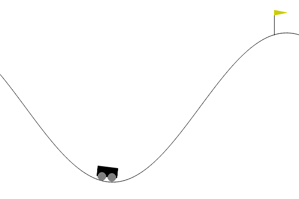
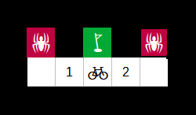
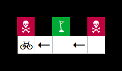
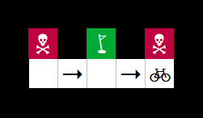
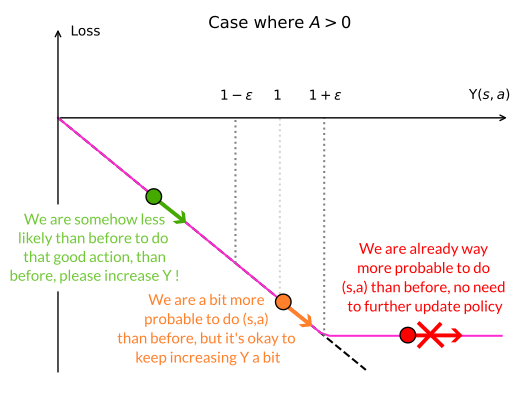

# From A to B with RL !

👋 Hello !

This repository is the two-week project in Data Science of four people
from `le Wagon` bootcamp in Paris. **Our aim is to adapt Reinforcement Learning algorithms to solve [Gymnasium](https://gymnasium.farama.org/) [environments](#environments)** using [several different algorithms](#algorithms).

You can clone this repo, and check for yourself how the algorithms perform. All the instructions are available in the [setup](#setup) section.

## Environments

### Frozen Lake 🌲

<p align="center">  </p>

In this very simple environment, we have :
- the agent state $s$, an integer from 0 to 24 representing its square nº.
- the possible agent actions $a$, here discrete actions $\leftarrow (0), \downarrow (1), \rightarrow (2), \uparrow (3)$
- a reward $r = +1$ on the square where the gift lies.

Reaching the gift ends an 'episode'. **Falling into one of the frozen lakes triggers the end of an episode too with no reward**. In the original game, the agent state $s$ corresponds to their observation $o$, which means the agent does not know its surroundings.

#### Variants

We have developed two variants of the Frozen Lake environment :

- One setting a **negative reward $r = -1$ for falling into the lake**
- One **allowing the agent to know the _type_ of the squares next to them**

### Car Racing 🏎️

<p align="center">  </p>

In this more complex environment :

- the agent **state** is directly a gameplay image (by default).
- the possible **actions** are discrete : `idle` (0), `left` (1), `right` (2), `gas` (3) and `brake` (4).
- the car gets a **negative reward** $r=-0.1$ for each frame** and gets **a positive reward $r\simeq 20$ for each new track tile reached by the car**.

#### Variants

We have always worked in a variant of the original environment, where we choose the observation to be a stack of several successive images (we have chosen 3 images). We did it by hand, before realizing there was a "VectorEnvironment" wrapper doing exactly that very easily 😅: reading the docs saves lives.

The environment also works with **continuous actions** along three axes :

- left/right in the range $[-1, \;1 ]$
- gas/no gas in the range $[0, \; 1]$
- brake/no brake in the range $[0, \; 1]$

Which means you can both accelerate, brake and turn at the same time : a perfect recipe for drifting !

### Mountain car ⛏️

<p align="center">  </p>

In this environment :

* The **state** $s$ (or observation $o$) is given by the _position_ of the car $x$ and its velocity $v$, both of which are unbounded.
* The car **action** is actually a force $F \in [-1,1]$ that can be applied to the car at each time step
* The **rewards** are a bit more subtle : a penalty of $-0.1 F^2$ is applied to prevent the car from applying large forces all the time. An additional reward of $+100$ is applied when the car moves past the flag. 
* **Termination** occurs when the flag is reached, or when $1000$ steps are accomplished.

### Lunar Lander 🛰️

<p align="center">  </p>

In this environment :

* The **observation** $o$ (equal to the state) contains 8 variables : 
  * the $x,y$ positions [continuous]
  * the $v_x, v_y$ linear velocities [continuous] 
  * the angle $\theta$ and angular velocity $\dot{\theta}$ of the lander [continuous]
  * two variables signalling contact between the _legs_ of the lander and the ground [boolean].
* The **actions are discrete** : do nothing [0], fire left orientation engine [1], fire main engine (upwards thrust) [2], fire right orientation engine [3]
* **Rewards** [are a bit elaborate](https://gymnasium.farama.org/environments/box2d/lunar_lander/), but they encourage the agent to get closer to the ground, to not go too fast and land safely -- and smoothly -- on the surface.
* The lander starts at the centre of the "viewport", but a random initial force it applied onto it. 
* **Termination** occurs when the lander crashes, gets outside of the field of view, or reaches "not awake" states. 

#### Variant

It is possible, as in [Car Racing](#car-racing-️), to make a _continuous_ variant of this environment, in which case we get two actions, one for the main engine (from -1 to 1) and one for the side engines (again from -1 to 1). [As mentioned in the official docs](https://gymnasium.farama.org/environments/box2d/lunar_lander/#arguments), the sign of the side engine action will determine _which_ lateral booster is used. 

## Algorithms

We are using several algorithms to solve these environments, from the simplest
(Q-learning) which uses no neural network, to the most complex (Proximal Policy
Optimization).

|                          Algorithm | Neural Network ?  | Infinite States    | Continuous Actions  |
|-----------------------------------:|:-----------------:|:------------------:|:-------------------:|
|                         Q-Learning |         ❌        |         ❌         |          ❌         |
|               Deep-Q Network (DQN) |         ✅        |         ✅         |          ❌         |
|       Advantage Actor Critic (A2C) |         ✅        |         ✅         |          ✅         |
| Proximal Policy Optimization (PPO) |         ✅        |         ✅         |          ✅         |

Some of them can deal with having a virtually infinite amount of states or observations. In [Frozen Lake](#frozen-lake-🌲),
the number of states is small (the number of squares) whereas for Car Racing, the states would be all the different
possible images returned by the game, which is nearly infinite.

Some algorithms can _not_ manage continuous actions, since they rely on computing _all the possible actions_ from a given
state and checking which one would lead to the highest reward. This is the case of Q-learning and DQN, which are therefore
not adapted to the continuous variant of [Car Racing](#car-racing-🏎️) or [Mountain Car](#mountain-car-⛏️).

### Some mathematical definitions

To understand a bit how these algorithms work, we need to introduce a few quantities.
A **policy** $\pi$ is what the agent uses to decide of an action based on its state $s$. We will for now suppose that the agent strictly follows that policy for all instants $t$, so we add a few subscripts $\,\cdot_t$ to represent that

$$ \pi(s_t) = a_t  \text{ at all times } t$$

Following this policy, we can define the **state value $V_\pi (s)$**.

> Imagine starting from a checkpoint at state $s$ at $t=0$ and let the game run in 'auto-mode' using the policy $\pi$ until you reach the end of the game. We sum all the rewards obtained by the agent and call the result the **state_value** of the policy $\pi$ starting from state $s$. In mathematical terms, we write it the following way:

$$ v_\pi (s) =  \left \lbrace \sum_t  r_t \Big \vert s_0 = s \right \rbrace $$

We _suppose_ that everything on the right of the vertical bar $\vert$ is true when we compute the rest of the equation. For mathematical reasons, we decide to put an emphasis on the short-term rewards by adding a **discount factor $0 < \gamma < 1$** in the previous equation, which will artificially decrease the "value" of rewards in the distant future, leading to a new quantity:

$$ V_\pi (s) = \left \lbrace \sum_t r_t \gamma^t \Big \vert s_0 = s \right \rbrace $$

The **action value function $Q_\pi(s,a)$ is roughly the same quantity, however we can take _any_ action at time $t=0$ and _then_ we follow the policy $\pi$**. Computing this function, or approximating it is one of the core ideas of Q-learning and DQN. We have:

$$ Q_\pi (s,a) = \left \lbrace \sum_t r_t \gamma^t \Big \vert s_0 =s, a_0 = a\right \rbrace $$

That function would be a two-dimensional array of size $N_s \times N_a$ in your computer memory, with $N_s$ being the number of different states and $N_a$ the number of possible actions. So, in the case of:
- [Frozen Lake](#frozen-lake-🌲), $Q$ would be a ($25 \times 4$) array, manageable
- [Car Race](#car-racing-️🏎️), the images defining the states are of size $(96 \times 96 \times 3)$ with each pixel taking a value between 0 and 255, so theoretically we have ($256^{96 \times 96  \times 3 } \times 5$) states, which is, for all practical purposes, $+\infty$. This is why regular $Q$-learning is impossible on Car Race.

### Q-learning

I think the critical question at this stage is : **how does computing Q-values help us teach an agent how to play games ?**. Let's assume that the $Q$ values _accurately_ represent the _true_ future rewards the agent will obtain in their episode. We can check, for every state, which action $a^* $ leads to the highest state-action value $Q(s,a^*). And we can define a policy $\pi^*$ to choose these 'optimal decisions' for every state $s$. Unsurprisingly, this policy is the _optimal_ policy. Mathematically, we write it as:

$$\pi^* (s) = {\rm argmax}_a \, Q(s,a)$$

The main issue is that **we do not know initially the _true_ state action values $Q(s,a)$**,
and we do not know which states and which actions lead to rewards! We have to build everything from scratch. How do we do that? Let's suppose the initial $Q^{\rm est}(s,a)$ table is initialized
with zeros, and that the agent has (randomly) reached the square to the right of
the gift (state $s = 21$):

<p align="center"></p>

But ... we don't really have a policy yet ! It is then hard to compute $Q^{\rm est}$, but let's try doing that for action $\leftarrow$:

$$Q^{\rm est} (s=21, \leftarrow) = 1 $$

There are no additional terms to the sum since the game (episode) ends after the elf reaches the gift. We could then update the $Q$-table so that it reflects this new value, and then the agent would 'learn' that doing $\leftarrow$ from state $s=21$ is a good idea !

But how do we compute the values for the _other_ actions, those that do not end the episode ? Let's start by re-writing the 'real' $Q(s_0,a)$ for a state $s_0$ (the subscript corresponds to $t=0$) in a slightly different way :

$$Q(s_0,a) = \left \lbrace r_0 + \gamma \sum_{t} r_{t+1} \gamma^t  \Big \vert s_0 = s, a_0 = a  \right \rbrace $$

What do these future rewards in the sum correspond to ? They do correspond to choosing the optimal policy for every step $t \geq 1$:

$$ \sum_t r_{t+1} \gamma^t  = {\rm max}_{a'} \, Q(s_1, a')$$

We can then rewrite the previous sum as :

$$Q(s_0,a) = \left \lbrace r_0 + \gamma \, {\rm max}_{a'} Q(s_1, a')   \Big \vert s_0 = s, a_0 = a  \right \rbrace $$

**Now, for the magic part : we arbitratily decide to apply the above equation, but with our $Q^{\rm est}$ 'empirical' estimate of the real $Q$**. We can use the right part of the above equation to _update_ the value of $Q^{\rm est}(s_0,a)$ (the left part of the above equation). In mathematical terms:

$$ Q^{\rm est}(s_0,a) \leftarrow r_0 + \gamma \, {\rm max}_{a'} Q^{\rm est} (s_1, a) $$

**By doing that, $Q^{\rm est}$ should _eventually_ converge towards  $Q$ after enough updates**. In practice, we will not completely overwrite the function each time we want to update it; we will rather update it by a small amount :

$$ Q^{\rm est}(s_0, a) \leftarrow (1 - \alpha) Q^{\rm est}(s_0, a) + \alpha  \left [ r_0 + \gamma \, {\rm max}_{a'} Q^{\rm est} (s_1, a) \right ] $$

If you want to know more, I can only recommend you read about the _excellent_
[intro to Q-learning by Maxime Labonne on Medium](https://towardsdatascience.com/q-learning-for-beginners-2837b777741). It notably shows how the Q-table is updated 'in the real world'.

### Deep-Q Networks (DQN)

Deep-Q networks were introduced in a [2013 conference article](https://arxiv.org/abs/1312.5602)
to solve one burning question : how do you build a $Q$-array if your number of states is
(as in Car Race) virtually infinite ? The article finds an interesting workaround.
They replaced the real $Q$-array with a **neural network** that works as a substitute
for the table : for a given state $s$, it will output $N_a$ $Q$-scores corresponding to all the possible actions.

The resulting Deep-Q network can either be fully connected if the number of states
is finite, but can also include convolutional neural network layers (CNNs) if
the state $s$ is an image -- or an image stack. They then provide a very flexible
alternative to Q-tables, that have allowed the original DQN team
to play Atari games with little to no adaptation of the game itself.

**How do we optimize / update the network ?** One way to optimize the model is
to create a loss $\mathcal{L}^{\rm dqn}$ that _forces_ the network to converge to the
accurate values of $Q$, in a manner that is similar to the iterative replacement
we did for regular Q-learning :

$$
\mathcal{L}^{\rm dqn} = \left \vert \underbrace{Q^{\rm dqn} (s_t,a_t)} _{\rm Current} - \underbrace{r_t - {\rm max}_a' Q^{\rm dqn}(s _{t+1}, a')} _{\rm Target} \right \vert
$$

Minimizing this loss (here, a MAE, but it could also be a Huber loss, or a MSE ...)
with a learning rate $\eta$ will lead to a $Q^{\rm dqn}$ that
slowly converges towards an unbiased (read _faithful_) estimation of the $Q$ values
of each state. From that, the agent can decide to make the best decision for any given state.

There are additional, more practical challenges before _actually_ implementing
a deep-Q network, notably :

- How to initially explore the environment instead of systematically trying to
make the best decision. This can be done using **$\epsilon$-greedy policies**, i.e.
making decisions at random with a probability $\epsilon$. Check out the [HuggingFace webpage on the subject](https://huggingface.co/learn/deep-rl-course/unit2/q-learning#step2).

- _When_ do we update the deep-Q network ? Using which data ? Instead of simply relying
on the data from the previous step, we can build a **replay memory buffer** that
saves the most recent (say $10\,000$) actions taken. We can then draw samples from
that replay buffer after each step and use this "batch" to continuously train
the deep-learning network. Check out the [HuggingFace section on the subject on the Deep-Q network page](https://huggingface.co/learn/deep-rl-course/unit2/q-learning#step2).

- How do we prevent too **much correlation between the Target part and the Current part of the network?**
One way to deal with this is to decouple these two networks, and only update the target
every $N$ steps. We can also decide to replace the target network more progressively
than the policy network to _stabilise_ the convergence of the algorithm.

More info on Deep-Q networks from the [very nice article of Yuki Minai on the subject](https://medium.com/@ym1942/deep-q-learning-dqn-tutorial-with-cartpole-v0-5505dbd2409e).

### Advantage Actor Critic (A2C)

#### Limitations of Q-learning based algorithms

In Deep-Q-learning, we only have _one_ neural network, that takes as input the _states_ (or _observations_) and returns _scores_ for each possible decision, from  which he best estimated decision can be taken. This means that :
1. __We need to compute this Q score for every possible action to select the best action__. 
  
2. __We have to follow the best determined action all the time once it has been determined__ if we consider that we no longer _explore_ with a probability $\epsilon$.

These two points raise a few issues : 

1. Let's imagine now that our actions are continuous, for instance the angle of a steering wheel if you are driving. How do we know what the best angle is if you want to turn left ? We could _discretize_ the possible actions (take 360 values) and build a DQN based on these 360 values. This becomes a bit of a pickle if you start having to take into account braking (another 100 values, say) and gas (another 100 values). If you are allowed to brake, accelerate and turn at the same time (a good starting point for _drifting_), you have $36\,000\,000$ possible actions. It does not really sound reasonable to train a model with _that many_ outputs.
   
2. For some specific states $s$, it might be optimal to act with a bit of uncertainty instead of being completely deterministic. A good example is the one presented in the [HuggingFace lecture on Policy gradients](https://huggingface.co/learn/deep-rl-course/en/unit4/advantages-disadvantages). Imagine a bicycle that moves in a small room filled with a trophy (good) and two spiders (bad). It only knows the type of the squares next to itself (a wall, an empty space, etc.). In this case, a Q-learning algorithm _should_ eventually lead to the same score for the squares $1$ and $2$, and there is a real possibility that the agent remains stuck regardless of what the agent decides to do (_systematically_) on squares 1 and 2.

<p align="center"><br/><i>A possible initial state for the bicycle (agent), with squares 1 and 2 being identical from the point of view of the agent.</i></p>


<p align="center"><br /> <i>Case where the best action of the trained model is determined to be going left (or right), and we start a new episode at the left (or right) of the room. The agent is stuck in both cases.</i></p>

One idea to solve the issue would be to compute _probabilities_ to make decisions based on a given state, instead of giving them a score. We would then need a method to modify these probabilities based on the future rewards that these decisions lead to. In that case, we can hope that the trained model agent have a 50/50 probability of going left or right when they are on squares $1$ and $2$.

A 'simple' -- everything is relative -- implementation of this idea is the [_REINFORCE_](https://huggingface.co/learn/deep-rl-course/en/unit4/policy-gradient#the-reinforce-algorithm-monte-carlo-reinforce) algorithm. We have decided to implement a slightly more complex algorithm, called _Advantage Actor Critic_ that solves a few issues with [_REINFORCE_](https://huggingface.co/learn/deep-rl-course/en/unit6/variance-problem) so that we can solve more complex problems.

#### Principle of the A2C

The **A2C** algorithm uses _two_ neural networks, an _actor_ network that makes decitions and a _critic_ network that judges them.

#####  The **actor network** 

It is tasked with making decisions based on the agent observations $o$. We can say it is the part of the algorithm in charge of $\pi(s)$. In this case, the $\pi(s)$ will represent the _probability distribution_ of taking the possible actions $a$. We will write it as $\pi(s,a)$ in this section. For discrete actions, we will have finite probabilities $0 < p(a) < 1$ for every action. For continuous actions, $\pi(s,a)$ will be a continuous probability density function (e.g. a normal distribution). 
  
##### The **critic** network 

It is tasked with judging the actions of the actor. They could be in charge, for instance, of estimating the action value $Q^{\rm est}(s,a)$ of the actions, but in the implementation the advantage $A$ is chosen instead. It is defined as : 

$$A(s,a) = Q(s,a) - V(s) = r + \gamma V(s') - V(s)$$

Here, the state $s'$ results from taking the action $a$ from the previous state $s$. The _advantage_ then measures how much better it is to make a particular action $a$ when the agent is in state $s$ compared to an 'average' action. I am not an expert in Reinforcement Learning, but apparently it helps _reduce the variance and stabilize_ the training process to choose $A$ compared to using $Q$. 

##### Optimizing the two networks 

How does the actor improve itself ? And how can the critic improve at all ?!? Two excellent questions ! **The actor will update the weights of its model, so the weights of $\pi(s)$, based on the input from the critic**. Basically, it will try to maximise the following function : 

$$ \mathcal{G} _ {actor} = \underbrace{\log \pi(s,a)}_ \text{from Actor} \, \underbrace{A^{\rm est}(s,a)}_\text{from Critic}$$

The actor will then adapt the weights of its policy $\pi$ to _increase_ the probability of choosing an action $a$ when it is very advantageous (according to the critic), and in contrast, it will _decrease_ the probability of choosing actions $a$ that have a negative advantage. The function $\mathcal{G}$ can be seen as the opposite of a loss. We will actually minimise $\mathcal{L} _{\rm actor} = - \mathcal{G} _ {\rm actor}$ in our code. The _rate_ at which the weights are modified for the actor is called $\alpha$, the actor learning rate. 

The **critic has to get as good as possible at knowing the rewards the actor will get when selecting a given action**. In a way similar to what we saw with [deep-Q networks](#deep-q-networks-dqn), we can build a similar loss of the following type (here, we take the mean squared error) : 

$$ \mathcal{L}_{\rm critic} = \left \vert r_t + \gamma Q^{\rm est}(s _{t+1},a _{t+1}) - Q^{\rm est} (s _t, a _t) \right \vert^2$$ 

When we minimise that loss, we become _better_ at predicting the reward we get, since we are continuously 'injecting some truth' (the $r_t$) into it. Let's consider a series of actions and rewards $(a_t, r_t)$ and rewrite our loss in terms of $V^{\rm est}$ : 

$$ \mathcal{L}_{\rm critic} = \left \vert r_t + \gamma \left [ r_ {t+1} + \gamma V^{\rm est}(s _{t+2}) \right ] - r_t - \gamma V^{\rm est}(s _ {t+1}) \right \vert ^2  $$

Rearranging some elements, we end up with :

$$ \mathcal{L}_{\rm critic} = \gamma \left \vert r _ {t+1} + \gamma V^{\rm est} (s _ {t+2}) - V^{\rm est} (s _ {t+1})\right \vert ^2 \simeq \gamma \left [A(s _ {t+1}, a _ {t+1}) \right ]^2$$

So our loss is essentially the square of the advantage $A^{\rm est}$, here for $t+1$ and with an additional factor $\gamma$. The latter is not really relevant to us, since multiplying a function by a constant will not change the location of its minimum. **The actual loss is computed from the advantage at time $t$ instead of $t+1$**, but the main principle behind it remains the same. The formula above also tells us that we _no longer need to compute_ estimated $Q$ values, so we can actually work around the issue of having too many model outputs !

#### When are we updating our networks in A2C ?

With the formula we currently use for the advantage $A(s,a)$, we can update the critic network at every step of an episode, which is very convenient when episodes can last infinitely long ; plus, we make sure that every step has the same _a priori_ weight.

We can however decide to update the network _at the end of every episode_ only. In that case, we can benefit from a much better estimate of the value of a step, since we no longer have to use an estimate of $V(s')$ in the definition of $A$. But ... this is no longer an Advantage Actor Critic method, it rather becomes [a policy gradient with an "advantage" baseline](https://pi-tau.github.io/posts/actor-critic/).

### Proximal Policy Optimization (PPO)

You would think that after all these improvements and tweaks, _any_ problem would be easily solvable using an A2C model. Once again, researchers stumbled upon issues, this time related to large policy updates. If the critic loss or the actor loss is massive, e.g. because of an unexpected large positive or negative reward, the corresponding policy change will also be dramatic, unless you choose a very low learning rate ; but in that case, you will basically learn nothing until you hit that large reward again. So how do we solve that ? Two main ideas have been floated around, the first being the [Trust-Region Policy Optimization](https://spinningup.openai.com/en/latest/algorithms/trpo.html#background), and **Proximal Policy Optimization**. 

#### Quantifying how "more likely" we are taking an action

Remember the actor loss in the A2C algorithm -- the inverse of its gain $\mathcal{G} _ {actor}$ :

$$ \mathcal{L} _ {actor} = - \log \pi(s,a) \, A^{\rm est}(s,a)$$

For now, there is no notion of policy change in the loss of the actor, so we don't really know how different the new policy will be compared to the old policy. One way to remediate this is to change the loss to include the probabilities associated with a previous policy :

$$ \mathcal{L} _ {actor,\,new} = - \underbrace{\frac{\pi (s, a)}{\pi ^ {\rm old} (s,a)}} _ {\Upsilon (s,a)} A ^ {\rm est} (s,a)$$

The numerator of the fraction $\Upsilon(s,a)$ represents the probability of the most recent agent policy, were this agent faced with the state (s) and decision (a). This "most recent policy" mainly exists when the agent is being updated (see [below](#so--when-are-we-updating-our-network-) for more details). The denominator represents the probability of the pairs of states and actions $(s,a)$ _at the time they were taken_. Minimising this loss means we will take steps to progressively update the policies $\pi (s,a)$ so that the fraction $\Upsilon(s,a)$ increases. So far, only limited change from [A2C](#advantage-actor-critic-a2c) !

#### Clipping the actor loss to avoid large policy changes

Let's examine what happens during an optimization step, so when we try to update the policy $\pi(s,a)$. Say the advantage is positive, i.e. it is good to do whatever action we are doing a bit more often. Proximal Policy Optimization will consider three different cases, schematically represented in the figure below : 

1. one where we are somehow _less likely_ now to perform this action than we used to, i.e.  $\pi(s,a) < \pi^{\rm old} (s,a)$. In this case (in green), we obviously want to increase the probability of performing this action more often
2. the second case (in orange) where we are _as likely_ as before to take this action. This case is defined by a region $1 - \epsilon < \Upsilon(s,a) < 1 + \epsilon$, we still decide to increase $\Upsilon$, as we did in case 1.
3. in the third case (in red), we are already significantly more likely to perform the action than before ... so maybe let's not beat a dead horse, and not increase further the value of $\Upsilon$. This was the case that A2C was struggling with.

<p align="center"></p>

Naturally, when the sign of $A$ is reversed, we have to do the opposite, and decide not to reduce further $\Upsilon(s,a)$ under $1-\epsilon$ even if that would reduce the non-truncated loss. To accommodate for all these constraints, the real loss is computed as :

$$\mathcal{L}^{\rm PPO} = {\rm max} \left [- \Upsilon A^{\rm est}, - \overline{\Upsilon} _ \epsilon A^{\rm est} \right ] $$

Note that I use the _opposite_ of the objective function used in most texts :  $\mathcal{L}^{\rm PPO} = - \mathcal{L}^{\rm CLIP}$. I have also defined the _$\epsilon$-clipped_ version of $\Upsilon$ as follows :

$$\begin{array}{rll}  \overline{\Upsilon} _ \epsilon &= 1 - \epsilon &\text{ for } \Upsilon \leq 1 - \epsilon \\ \overline{\Upsilon} _ \epsilon &= \Upsilon & \text{ for }  1 - \epsilon  < \Upsilon < 1 + \epsilon \\ \overline{\Upsilon} _ \epsilon &= 1 + \epsilon &\text{ for } \Upsilon \geq 1 + \epsilon \end{array}$$

#### Dealing with the critic in PPO

The critic part of the PPO algorithm has the same job as in the A2C algorithm, it has to model the _value_ of a state in an accurate fashion, so we will simply compute the advantage, and its square will be -- again -- the loss to minimize. In this case, we do not take advantage of the Bellman equation and we rather use the _true_ value of the discounted rewards for the future state: 

$$\mathcal{L}^{\rm critic} =   \left [\sum _ {k = t} ^ T r _ {k} \gamma^{k - t} -  V^{\rm est}(s) \right ]^2 = \left [ r_k + V(s') - V^{\rm est}(s) \right ] = \text{Some advantage } A$$

We cannot have access to the sum _unless_, as we said, we have some memory of the states that have been accessed, the rewards that have been collected. We cannot update the model at every step like A2C because of this, and also -- as mentioned above -- because we have to compare $\pi (s,a)$ and $\pi ^ {\rm old} (s,a)$. 

#### So ... _when_ are we updating our network ?

That is an excellent question. Also ... with what data ? In PPO, we  collect a sequence of data (it can span over multiple episodes), and we  divide it into mini-batches. We then train our network on these minibatches _several times_ (several epochs), so our model policy $\pi(s,a)$ progressively diverges from $\pi ^ {\rm old} (s,a)$. But it does not diverge too fast from it since we have cleverly clipped our loss (or objective function).

### Help ! People talk about on and off-policy, policy-based and model-based agents. What do they mean ?

There is no point repeating a clear explanation, so I will just leave you with the [excellent explanation of Tomasz Bartkowiak on StackExchange](https://stats.stackexchange.com/questions/407230/what-is-the-difference-between-policy-based-on-policy-value-based-off-policy).
To summarise the networks we have seen so far, our implementation of

* **DQN** is
  * Off-policy : we are using the _replay memory_ to improve the agent
  * Value-based : our neural network computes Q values for the states (and actions) instead of directly choosing actions
* **A2C** is
  * On-policy : we are continuously updating the most recent version of the agent based on the most recent environment info (states, rewards)
  * Actor-critic : yes, we explicitly compute a policy with the actor network, ... but the critic computes the value of each state, so it is a mix between policy and value-based.
* **PPO** is :
  * On-policy-ish : we are letting our agent play with the most recent policy (without updating it) before doing our update with the minibatches. So _maybe_ when the model is being updated and after a few epochs, we are slightly _off-policy_, but we quickly revert to _on-policy_ when we start sampling the environment again. Plus, we cannot deviate too far from our previous policy.
  * Actor-critic : yet again, we have both a policy network and a value network.
* **REINFORCE**, that I briefly mentioned, is :
  * On-policy : as with A2C, REINFORCE continuously updates the agent.
  * Policy-based : here, we have no critic, we only update the policy network based on an objective function.


## Setup

We work with [Python v3.11.9](https://www.python.org/downloads/release/python-3119/) and our virtual environment is named `rl`. I used to work with [`pyenv`](https://github.com/pyenv/pyenv) with the [`virtualenv` extension](https://github.com/pyenv/pyenv-virtualenv) and [`direnv`](https://direnv.net/) to make it work. That stack works great on Linux, because then you can just switch between different virtual environments when you are cd'ing into project folders.

However it does not work so well on Windows, because the virtual environments would not work so well. If you are on Windows, you can still install [pyenv-win](https://pyenv-win.github.io/pyenv-win/) to have several concurrent Python versions, but it is not as convenient. 

### Vanilla Python

Let's create our virtual environment (replace the `\` with a `/` for Linux and MacOS, but frankly just use `direnv` then !)

```
  cd ~
  python -m venv .venv\rl
```

**On Windows and Powershell** we can then activate it this way :

```
  ~\.venv\rl\Scripts\Activate.ps1
```

You should then see a `(rl)` next to your command prompt if the activation has worked. 

### Pyenv-virtualenv & direnv

You can again create your virtual environment. The syntax is :

```
  pyenv virtualenv 3.11.9 rl
```

Then, you can cd to the `from-a-to-b-with-rl` folder, and check if it is activated.

If the virtual environment is not activated automatically upon entering the folder you can run:

```
  pyenv local rl
```

### Packages

The `rl` virtual environment has a few dependencies, notably :

- [pytorch](https://pytorch.org/) for the RL learning
- [numpy](https://numpy.org/) to handle a few numerical outputs
- [pandas](https://pandas.pydata.org/) because dataframes are neat
- [gymnasium](https://gymnasium.farama.org/)
- [pygame](https://www.pygame.org/news)
- [moviepy](https://pypi.org/project/moviepy/) to save video from the agent interacting with the environment
- [matplotlib](https://matplotlib.org/) because we ultimately want graphs
- [swig] to wrap some C/C++ code with Python
- [box2d] to run some of the environments. We install it with a few additional options since otherwise it was just not installing on some of our machines. 

You can then decide to install the package itself (XXX
Note, for now, nothing interesting is installed except from the dependencies XXX):

```
  pip install .
````

Or just decide to install the `requirements.txt` file :

```
  pip install -r requirements.txt
```

### Notes on GPU acceleration :

If your GPU is CUDA capable, you will have to adapt your `rl` environment. If you are on Windows, you can type :

```
  pip uninstall torch

  pip install torch torchvision torchaudio --index-url https://download.pytorch.org/whl/cu121
```

If you are on Linux, you can do :

```
  pip uninstall torch

  pip3 install torch torchvision torchaudio
```

If you want to monitor the GPU in the terminal, you can type

```
  nvidia-smi -l 1
```
